# Automactic fake news detection in Portuguese

This project tries to develop and evaluate new models for automatic detection of fake news in Portuguese in comparison with classic approaches. 

Misinformation is an ongoing and dangerous problem that continually adapts and evolves. It gained two new tools in the digital age: social media recommendation algorithms, and the generation of high-quality content with Large Language Models (LLM) and deepfakes. Considering the influence of fake news in current times, where the spread of false information can impact public opinion, political decisions and even public health, it becomes crucial to create efficient methods to identify and mitigate this issue.

Therefore, this monograph aims to automatically detect fake news in Portuguese using four models: two based on linguistic features, another based on the content itself utilizing a knowledge graph, and one based on language modeling using an LLM. The dataset used to train and evaluate the models will be the FAKE.BR Corpus. The results are going to be measured and compared with performance metrics. The contribution of this work lies in the use of machine learning and text analysis approaches to detect fake news in Portuguese, creating tools to diminish the propagation of false information on a large scale on digital media.

**Key-words**: Text classification, natural language processing, machine learning, fact checking, fake news.

## Dataset

The datasets used for training, testing and validating the classification models are described below:

* [FAKE.BR CORPUS](https://github.com/roneysco/Fake.br-Corpus).
    + News aligned, each false text has its respective true one.
    + 3600 fake news, 3600 true news.
    + Miscellaneous topics until 2018.
    + Each news item has its own metadata.
    + Long texts with more than 100 words.
  

* Custom, created by the author, taken from [G1](https://g1.globo.com/fato-ou-fake/).
    + 7 fake news, 7 true news.
    + Miscellaneous topics in 2023.
    + Long and short texts.
  

* Covid, created by the author, taken from [G1](https://g1.globo.com/fato-ou-fake/).
    + 15 fake news, 15 true news.
    + Only texts about Covid.
    + Long and short texts.
  

FAKE.BR Corpus was used with 70-30 train-test split while the Custom dataset and the Covid dataset were used exclusively for model validation. The validation dataset, while small, are important to analyze the effectiveness of our models on topics not covered during the training phase, providing a reliability assessment in different contexts.

## Bag of Words

The Bag-of-Words model represents text as a collection of words, ignoring ordering and grammar. It does so by representing text as an array with the frequencies of each word. One possible example of such representation is given bellow for the phrase "I love studying NLP, NLP is awesome". Notice how the ordering is discarted (studying comes before PLN, for example).

| love | nlp | studying | awesome | is | hate | I |
|:----:|:---:|:--------:|:-------:|:--:|:----:|:-:|
| 1    | 2   | 1        | 1       | 1  | 0    | 1 |

We tested 10 different models, 5 of which were ensambles and 5 were normal algorithms. The table shows the achieved accuracies for each dataset and also the train times ($T_t$) and prediction times ($T_p$).

| **Algorithm** | **Accuracy (\%)** | **F1-Score (\%)** | **Custom (\%)** | **Covid (\%)** | **$T_t$ (s)** | **$T_p$ (s)** |
|:--------------|:-----------------:|:-----------------:|:---------------:|:--------------:|:-------------:|:-------------:|
| Decision Tree | 77,2              | 77,2              | 76,8            | 69,2           | 11,8          | **0.1**       |
| KNN           | 68,5              | 71,6              | 60,7            | 47,5           | **0,0**       | 3.6           |
| MLP           | **89,9**          | **89,9**          | 82,1            | 71,7           | 71,9          | 0.2           |
| NB            | 86,8              | 87,0              | 92,9            | **80,8**       | 1,7           | 0.3           |
| SVM           | 89,7              | 89,7              | 92,9            | 65,8           | 349,3         | 220.5         |
| AdaBoost      | 83,8              | 83,8              | 89,2            | 55,0           | 65,7          | 3.4           |
| CatBoost      | 88,7              | 88,7              | 92,9            | 63,3           | 70,0          | 6.1           |
| GradientBoost | 84,5              | 84,9              | 91,1            | 79,2           | 295,9         | **0.1**       |
| LGBM          | 88,7              | 88,7              | 91,1            | 55,8           | 1,3           | **0.1**       |
| Random Forest | 86,9              | 86,9              | **98,2**        | 73,3           | 14,9          | 0.2           |

The best models are visually shown bellow

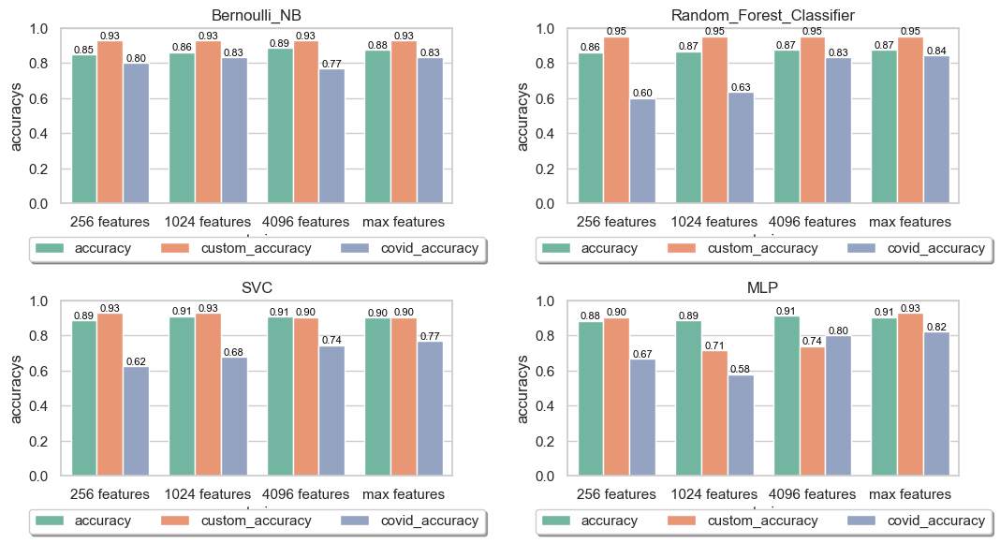

## Complex Networks

This approch consist in converting the text into a graph and then applying different Complext Networks measures from [networkX](https://networkx.org/) to futher on use it in different machine learning algorithms.

The metrics used are displayed below:

* Centrality
    + **Betweenness**
    + Closeness
    + Eigenvector
    + Katz
    + PageRank
    + Hubs
    + Authorities
  

* Clustering
    + Cluster
    + Cluster mean
    + Correlation
    + Transitivity
  

* Other
    + Density
  

To create the graphs three approchs were explored. In this important to note that both syntatic approchs used [UDPipe 2](https://ufal.mff.cuni.cz/udpipe/2) for text analyzes.

* Adjacency: Each word in the text becomes a vertex. The edges are formed according to the appearance of the words of the text, so that there is an edge starting from the word current, pointing to the subsequent word in the text.

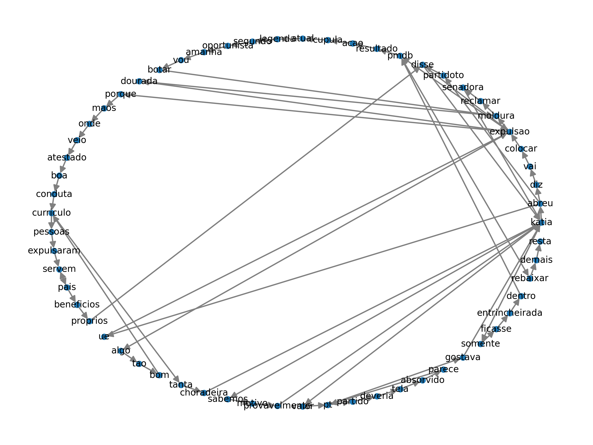

* Syntactic (index): Each index generated by UDPipe 2 becomes a vertex, allowing vertices representing the same word. Edges are formed according to their syntactic relationship.

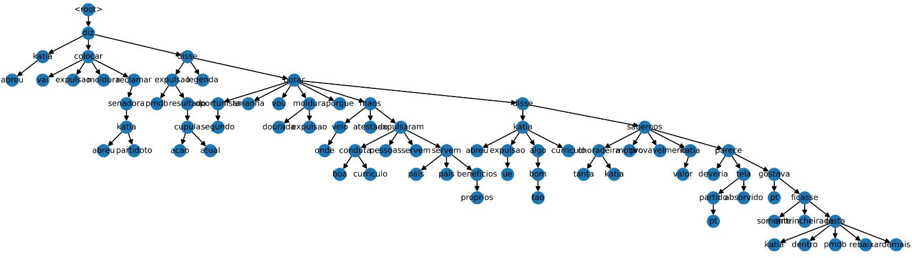

* Syntactic (lemma): Each lemma generated by UDPipe 2 becomes a vertex, allowing that similar words like "loved" and "love" are represented by the same token "love". Edges are formed according to their syntactic relationship.

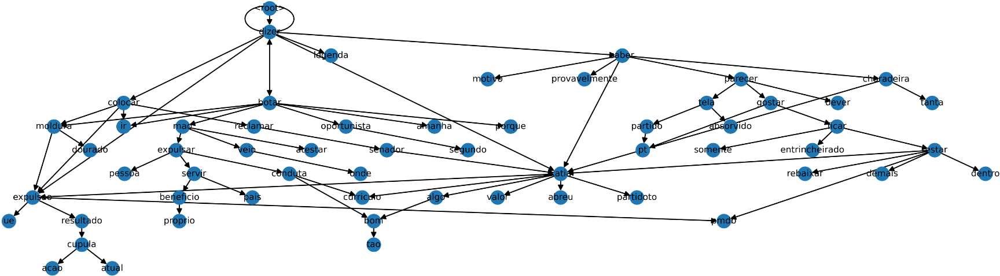

The accuracy for each approach using all metrics are shown below:

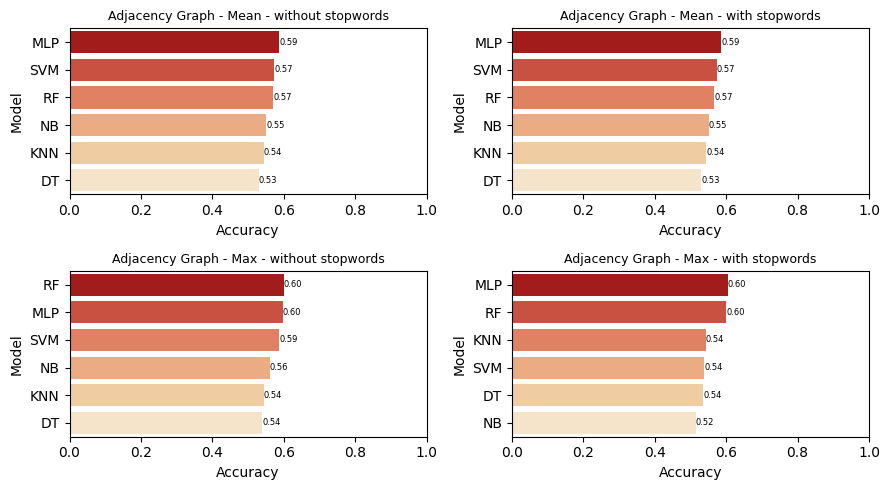
  
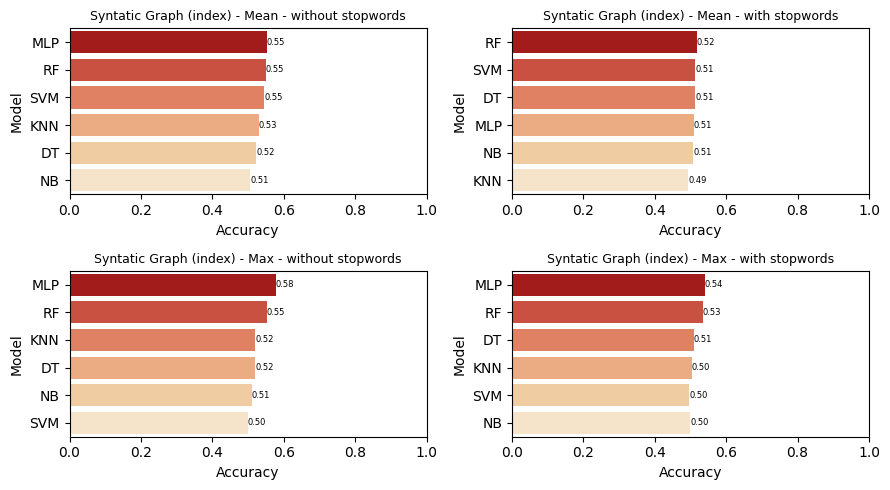
  
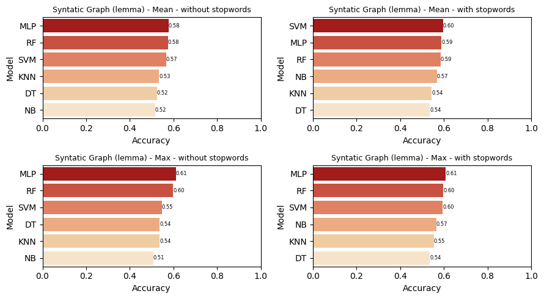

Initially, there is a clear advantage of the adjacency and syntactic lemma approaches. Therefore, it is believed that the tree structure presented in syntactic index, which does not allow clustering metrics, contributes negatively to text classification.

Comparing the new syntactic lemma approach with the old adjacency one, subtle improvements of up to 2% can be seem, indicating that the syntactic analyzes of the text can indeed contribute for news classification. However, the entire parsing process and the increased complexity in generating the graph makes it hard to justify with that small increase of the model.

## Knowledge Graphs

Knowledge graphs are widely used in knowledge representation where entities are connected to each other in a meaningful way. By utilizing this data structure, we attempt to classify news based on their content rather than how it was written.

To do that we used a syntactic analyzer ([UDPipe 2](https://ufal.mff.cuni.cz/udpipe/2)) to generate tuples in a never done before way. These tuples are in the format (subject, relation, object) and a combination of tuples generated by accurate news makes our graph. Check out our [source code](Part_2.2-Knowledge_Graphs/udpipe2_tuples_generator.py) for more details. An example of a knowledge graph with UDPipe 2 generated tuples is found bellow. 

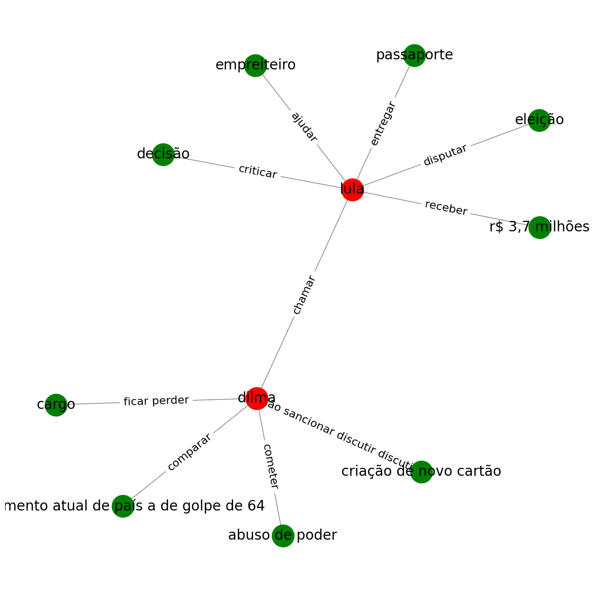

The hypothesis is that tuples generated by true news are going to have greater *semantic proximity* than their fake counterparts. You can think of it as true news having more support from other true news than fake ones. 

The semantic proximity can be calculated using this formula, where $v_1$ is a node representing the subject, $v_n$ is the object, $v_2 \dots v_{n-1}$ is a minimal path between them and $k(v_i)$ is the degree of the ith node.

$$
W(P_{s,o}) = W(v_1, \dots, v_n) = \left[ 1 + \sum_{i=2}^{n-1} \log k(v_i) \right] ^ {-1} 
$$

The truth value will then be defined as the maximum semantic proximity from all minimal paths between $v_1$ and $v_n$. Afterwards, the truth value for an entire news is the average of the truth value for every generated tuple. By doing that, we got the following box plots which show the truth values of each kind of new in our training dataset.

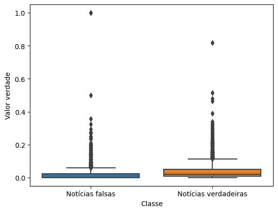

We noticed there was a huge number of outliers and after investigation it was clear that most were very short news or completly misslabeled by the FAKE.BR Corpus, often both. We decided on removing them from our training as shown bellow, which hugely increased our models accuracy afterwards.

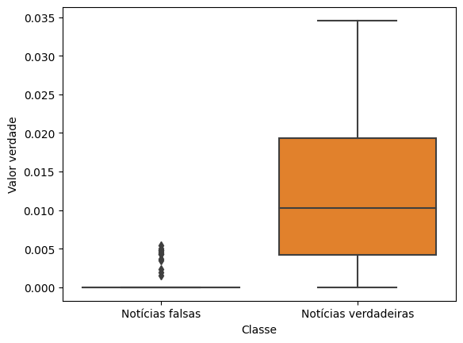

The results are presented in the table bellow. 

| **Results**      | **Accuracy (\%)** | **F1-score (\%)** | **Custom (\%)** | **Covid (\%)** |
|------------------|:-----------------:|:-----------------:|:---------------:|:--------------:|
| With outliers    | 58,1              | 58,0              | 35,7            | 50,0           |
| Without outliers | 71,6              | 76,0              | 35,7            | 56,7           |

Notice how much our performance degrades when dealing with our validation tests. This is expected since our knowledge graph does not have any information of events that happend after 2018 and the validation tests are recent news (2022-2023).

## Large Language Models (BERT)

We also explored models based on language modeling using [BERT](https://huggingface.co/docs/transformers/model_doc/bert), which are currently the state of the art in a lot of natural language processing tasks. We utilized [BERTimbau-base](https://huggingface.co/neuralmind/bert-base-portuguese-cased) a pre-trained 110M parameters model for the portuguese language. We tested the performance with and without fine tunning of the internal layers and with 3 and 5 training epochs.

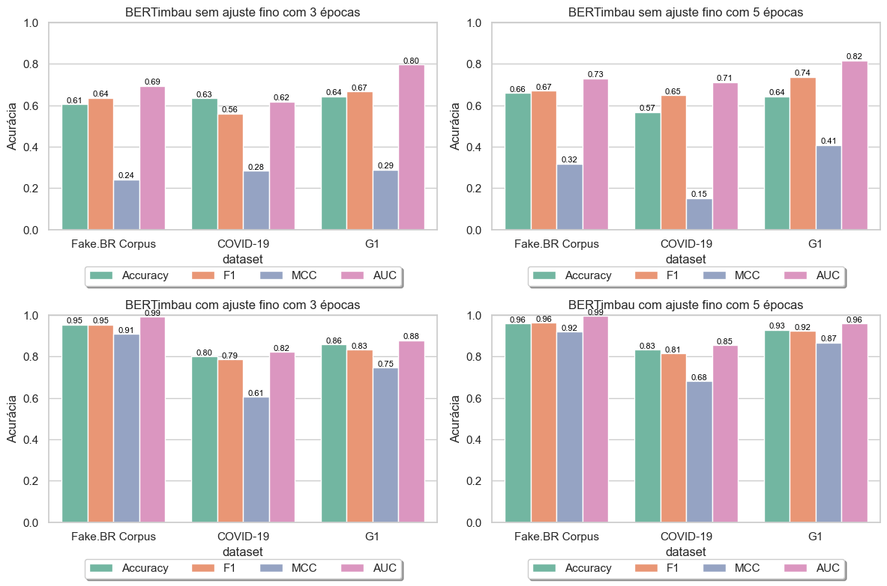

We noticed that fine tunning of internal layers is necessary to achieve state of the art performance for fake news classification. We also noticed that the increase from 3 to 5 training epochs increased our accuracy, specially in our validation dataset.

## Best results

| **Resultados**     | **Accuracy (\%)** | **F1-score (\%)** | **Custom (\%)** | **Covid (\%)** |
|--------------------|:-----------------:|:-----------------:|:---------------:|:--------------:|
| Bag-of-Words       | 89.9              | 89.9              | 82,1            | 71,7           |
| Knowledge Graphs   | 71.6              | 76.0              | 35,7            | 56,7           |
| Complex Networks   | 61.0              | -                 | -               | -              |
| BERT               | **96.0**          | **96.0**          | **93.0**        |**83.0**        |

## Full Monographs (Portuguese only)

Alessandro Guerreiro (Knowledge Graphs): https://drive.google.com/file/d/1xPpXW0DgdMY9G6dEViitbQ-qN4c4iNTO/view?usp=sharing

Eduardo Valença (Complex Networks): https://drive.google.com/file/d/1C8KVY6uCX4x0NZxolunC1o4jWFPi5gHi/view?usp=sharing
